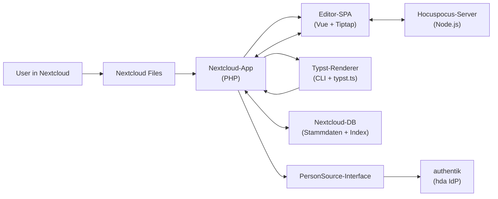
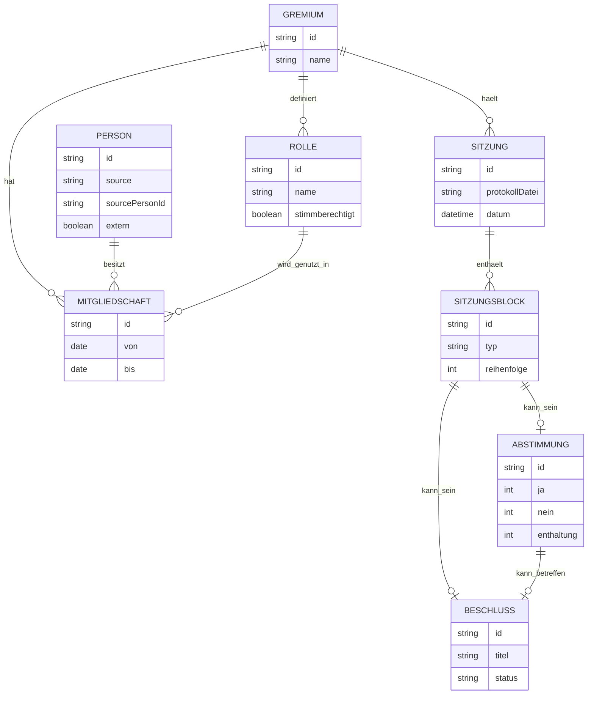
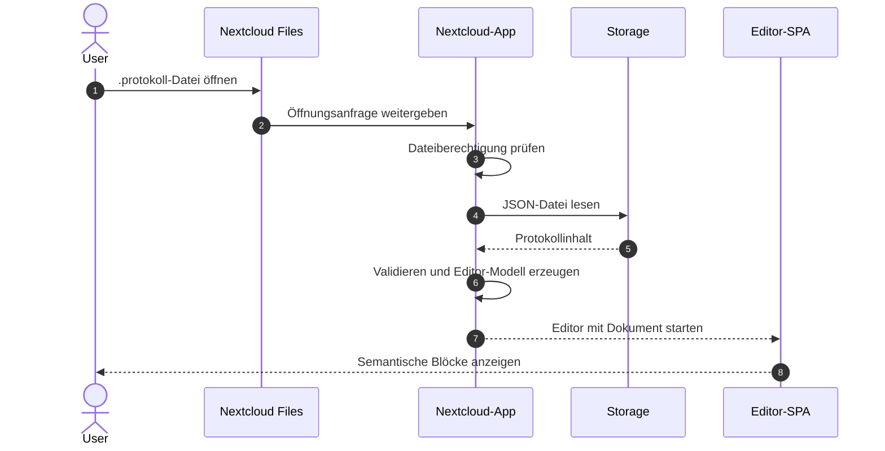
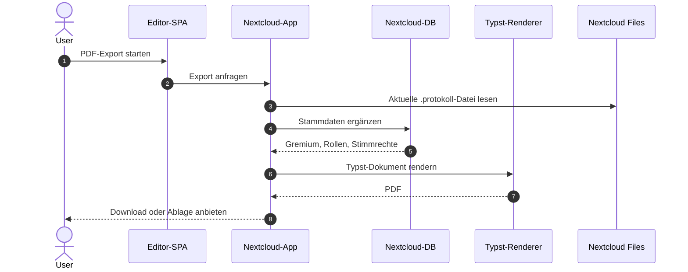
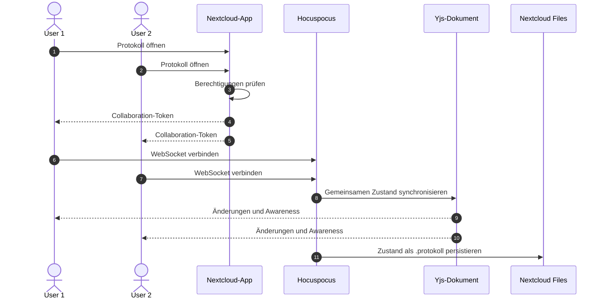

# Architektur

`nextcloud-protokolle` ist als Nextcloud-App mit mehreren lose gekoppelten
Schichten geplant. Die Architektur soll die Stärken von Nextcloud nutzen:
Dateien, Berechtigungen, Sharing, Nutzerverwaltung und App-Framework bleiben
die Basis. Der Protokoll-Editor ergänzt diese Basis um eine
domänenspezifische Schreib- und Export-Erfahrung für studentische Gremien.

## Inhaltsverzeichnis

- [Komponenten-Übersicht](#komponenten-übersicht)
- [Datenmodell](#datenmodell)
- [Datenfluss A: User öffnet Protokoll](#datenfluss-a-user-öffnet-protokoll)
- [Datenfluss B: PDF wird exportiert](#datenfluss-b-pdf-wird-exportiert)
- [Datenfluss C: Zwei User editieren live parallel](#datenfluss-c-zwei-user-editieren-live-parallel)
- [Design-Entscheidungen](#design-entscheidungen)

## Komponenten-Übersicht

Die geplante Architektur besteht aus vier lose gekoppelten Schichten:

1. **Nextcloud-App-Schicht**

   Diese Schicht integriert sich in Nextcloud Files, stellt Controller,
   Services, Datenbank-Migrationen und App-Routen bereit und prüft
   Berechtigungen über die bestehenden Nextcloud-Mechanismen. Sie ist die
   verbindende Schicht zwischen Dateiablage, Stammdaten, Export und UI.

2. **Editor-Schicht**

   Der Editor wird als Vue-3-Anwendung mit Tiptap geplant. Er arbeitet mit
   semantischen Blöcken statt nur mit formatiertem Fließtext. Ein
   Tagesordnungspunkt, eine Abstimmung oder ein Beschluss sind dadurch nicht
   bloß optische Abschnitte, sondern strukturierte Inhalte mit eigener
   Bedeutung.

3. **Collaboration-Schicht**

   Für Live-Collaboration ist ein Hocuspocus-Server mit Yjs vorgesehen. Diese
   Schicht ist bewusst separat, damit der Single-User-MVP ohne WebSocket-
   Infrastruktur funktionieren kann. Später vermittelt eine Auth-Bridge
   zwischen Nextcloud-Session und Collaboration-Server.

4. **Rendering- und Export-Schicht**

   PDF-Ausgaben werden final serverseitig mit Typst CLI erzeugt. Für schnelle
   Vorschauen im Browser ist später `typst.ts` geplant. Beide Wege sollen aus
   demselben strukturierten Protokollmodell rendern, aber unterschiedliche
   Zuverlässigkeits- und Latenzanforderungen bedienen.

## Datenmodell

Das Datenmodell trennt Stammdaten, Sitzungsinhalte und exportierbare
Beschlussdaten.

**Gremium** beschreibt eine organisatorische Einheit wie AStA, StuPa, FSK
oder einen Fachschaftsrat. Ein Gremium besitzt Namen, optionale Metadaten und
eine Menge von Rollen und Mitgliedschaften.

**Person** beschreibt eine natürliche Person. Personen werden über
austauschbare Backends angebunden, die ein gemeinsames `PersonSource`-
Interface erfüllen. Für die hda ist zunächst `AuthentikPersonSource` über
die authentik-API (https://goauthentik.io/) als Quelle geplant. Später können
`NextcloudUserPersonSource` für Nextcloud-User und `ManualPersonSource` für
vollständig manuell gepflegte Personen ergänzt werden. Externe Personen wie
Gäste bleiben unabhängig vom Backend immer manuell pflegbar.

**Rolle** beschreibt eine Funktion innerhalb eines Gremiums, zum Beispiel
Mitglied, Vorsitz, Gast, Protokoll oder beratendes Mitglied. Rollen tragen ein
Stimmrecht-Flag. Dadurch wird Stimmrecht nicht direkt an einzelne Personen
gehängt, sondern an die Rolle, die eine Person in einem Gremium innehat.

**Mitgliedschaft** verbindet Person, Rolle und Gremium über einen Zeitraum.
So lässt sich abbilden, dass eine Person in einem Semester stimmberechtigtes
Mitglied ist, später aber nur noch beratend teilnimmt oder aus dem Gremium
ausscheidet.

**Sitzung** lebt inhaltlich in einer `.protokoll`-Datei. Die Datei ist die
primäre Quelle für Tagesordnung, Mitschrift, Abstimmungen und Beschlüsse.
Die Datenbank kann Sitzungen indizieren, zum Beispiel für Listenansichten,
Suche, Beschlussverweise oder Exporte.

**Sitzungsblock** ist ein strukturierter Abschnitt innerhalb einer Sitzung.
Geplante Blocktypen sind TOP, Bullet, Abstimmung, Beschluss und Anwesenheit.
Der Editor darf diese Blöcke komfortabel bearbeitbar machen, während das
Dateiformat die semantische Struktur erhält.

**Beschluss** ist eine eigene Entität mit stabiler ID. Ein Beschluss entsteht
aus einem Beschlussblock, soll aber später auch unabhängig indexiert und
über eine REST-API abgefragt werden können.

**Abstimmung** beschreibt eine strukturierte Entscheidungssituation mit
Ja-/Nein-/Enthaltungswerten, Stimmrechtskontext und optionalem Bezug zu einem
Beschluss.

## Datenfluss A: User öffnet Protokoll

1. Ein*e Nutzer*in öffnet in Nextcloud Files eine `.protokoll`-Datei.
2. Die Nextcloud-App prüft die Dateiberechtigung über Nextcloud.
3. Die App liest die JSON-Datei aus dem Storage.
4. Das Dokument wird validiert und in ein Editor-Modell überführt.
5. Der Vue/Tiptap-Editor rendert die semantischen Blöcke.
6. Beim Speichern wird das Editor-Modell wieder als `.protokoll`-JSON
   geschrieben.

Im MVP ist dieser Datenfluss single-user-fähig. Live-Collaboration kommt erst
in einer späteren Phase hinzu.

## Datenfluss B: PDF wird exportiert

1. Die Nutzerin oder der Nutzer startet den PDF-Export aus dem Editor.
2. Die Nextcloud-App liest die aktuelle `.protokoll`-Datei.
3. Stammdaten wie Gremium, Rollen, Anwesenheit und Stimmrechte werden aus der
   Datenbank ergänzt.
4. Ein Rendering-Service erzeugt aus Protokolldaten und Typst-Template ein
   Typst-Dokument.
5. Der Server ruft Typst CLI auf.
6. Das erzeugte PDF wird als Download angeboten oder neben dem Protokoll in
   Nextcloud Files abgelegt.

Der finale Export läuft serverseitig, weil dort Fonts, Versionen und
Reproduzierbarkeit besser kontrollierbar sind als in einem Browser.

## Datenfluss C: Zwei User editieren live parallel

1. Zwei berechtigte Nutzer*innen öffnen dieselbe `.protokoll`-Datei.
2. Die Nextcloud-App prüft für beide die Berechtigung und stellt ein
   Collaboration-Token oder eine vergleichbare Session-Brücke bereit.
3. Der Editor verbindet sich mit dem Hocuspocus-Server.
4. Yjs synchronisiert Änderungen in Echtzeit zwischen den Clients.
5. Awareness-Daten wie Cursor, Name und aktuelle Auswahl werden verteilt.
6. In definierten Intervallen oder bei stabilen Zustandswechseln wird der
   Yjs-Zustand zurück in das `.protokoll`-Format persistiert.

Die genaue Persistenzstrategie wird in Phase 2 festgelegt. Wichtig ist, dass
Nextcloud-Berechtigungen weiterhin die Autorität für Zugriff bleiben.

## Design-Entscheidungen

### Datei-basiert statt DB-basiert

**Entscheidung:** Protokolle leben als `.protokoll`-Dateien im normalen
Nextcloud-Dateibaum. Die Datenbank speichert Stammdaten, Rollen,
Mitgliedschaften und Indizes, aber nicht den primären Protokollinhalt.

**Begründung:** Protokolle sind Dokumente und sollen sich in Nextcloud wie
Dokumente verhalten: Sie liegen in Ordnern, können geteilt, verschoben,
versioniert, gesichert und über bestehende Berechtigungen kontrolliert werden.
Eine rein DB-basierte Ablage würde viele dieser Stärken umgehen und eine
zweite, app-spezifische Dokumentenwelt erzeugen.

**Konsequenzen:** Die App muss das `.protokoll`-Format stabil validieren,
lesen und schreiben. Dafür bleibt der Files-Workflow für Nutzer*innen
verständlich und kompatibel mit Nextcloud-Sharing.

### Hybrid-Rendering

**Entscheidung:** Browser-Vorschau und finaler PDF-Export werden getrennt:
Live-Preview perspektivisch über `typst.ts`, verbindlicher Export
serverseitig über Typst CLI.

**Begründung:** Live-Arbeit braucht schnelle Rückmeldung. Dafür ist eine
Browser-Preview attraktiv, weil sie ohne Server-Roundtrip ein visuelles Gefühl
für das spätere PDF geben kann. Der finale Export braucht stabile Fonts,
reproduzierbare Versionen, saubere Fehlerbehandlung und serverseitige
Kontrolle.

**Konsequenzen:** Beide Renderer müssen aus demselben strukturierten
Protokollmodell gespeist werden. Der Server-Export bleibt die maßgebliche
Ausgabe, falls Vorschau und finaler Export voneinander abweichen.

### AGPL-3.0

**Entscheidung:** Das Projekt steht unter der GNU Affero General Public
License v3.0.

**Begründung:** Die App ist für gemeinschaftlich betriebene Infrastruktur
gedacht. Gerade bei serverseitiger Software kann es passieren, dass
Verbesserungen zwar genutzt, aber nicht zurückgegeben werden. Die AGPL-3.0
stellt sicher, dass auch bei Netzwerkbetrieb die Freiheit der Nutzer*innen und
die Rückgabe von Verbesserungen ernst genommen werden.

**Konsequenzen:** Betreiber*innen, die die App verändern und über das Netz
nutzbar machen, müssen die entsprechenden Quellen verfügbar machen. Das passt
zum Ziel, gemeinsame Lösungen für studentische Selbstverwaltung nicht in
isolierte Einzellösungen zerfallen zu lassen.

### Rollenbasierte Stimmrechte

**Entscheidung:** Stimmrechte werden über Rollen in Mitgliedschaften
abgeleitet, nicht direkt an einzelne Personen geschrieben.

**Begründung:** In Gremien hängt Stimmrecht selten dauerhaft an einer Person
allein. Es ergibt sich aus Funktion, Wahlperiode, Gremium und Zeitraum.

**Konsequenzen:** Wechsel werden nachvollziehbarer: Wenn eine Person eine
andere Rolle bekommt oder eine Mitgliedschaft endet, ändert sich das
Stimmrecht über die Struktur, nicht über einzelne Sonderregeln. Gleichzeitig
bleibt abbildbar, welche Personen in einer konkreten Sitzung stimmberechtigt
waren.

### Austauschbare Personen-Quellen

**Entscheidung:** Personen-Quellen werden über ein abstraktes Backend-
Interface angebunden, nicht hart an Nextcloud-User gekoppelt. Geplante
Implementierungen sind `AuthentikPersonSource`, `NextcloudUserPersonSource`
und `ManualPersonSource`.

**Begründung:** Studierendenschaften haben unterschiedliche Identitäts-
Infrastrukturen. Die hda nutzt authentik, andere Studierendenschaften haben
eventuell keinen IdP oder andere Lösungen. Eine harte Kopplung an
Nextcloud-User würde fzs-Tauglichkeit unnötig einschränken.

**Konsequenzen:** Es entsteht mehr Initialaufwand für ein sauberes Interface.
Dafür bleiben spätere Erweiterungen ohne grundlegendes Refactoring möglich.
Phase 1a startet mit authentik als einziger Implementierung; weitere Backends
kommen in späteren Phasen. Externe Personen wie Gäste bleiben unabhängig vom
gewählten Backend manuell pflegbar.

### Versionsverwaltung über Nextcloud Files

**Entscheidung:** Das Projekt nutzt die eingebaute Dateiversionierung von
Nextcloud und implementiert keine eigene Versionierungsschicht für
`.protokoll`-Dateien.

**Begründung:** Nextcloud bringt bereits eine bekannte Dateiversionierung mit.
Diese Entscheidung bedeutet weniger Code, weniger Wartung und weniger
Sonderlogik. Sie integriert sich außerdem in den Files-Workflow, den die
Nutzer*innen ohnehin kennen.

**Konsequenzen:** Wiederherstellung und Historie folgen den Nextcloud-
Mechanismen. Die App sollte keine konkurrierende Versionsoberfläche bauen,
sondern klar dokumentieren, wie Protokollversionen über Nextcloud Files
funktionieren.
