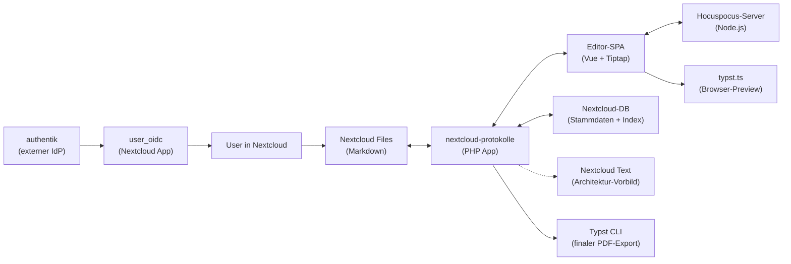
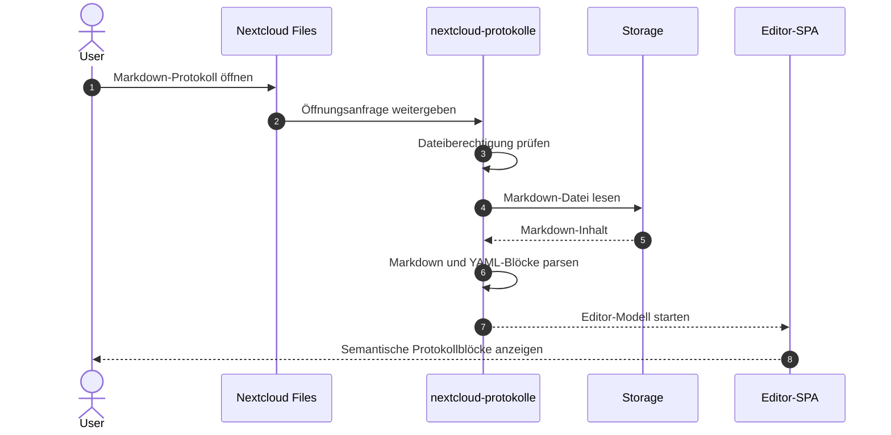
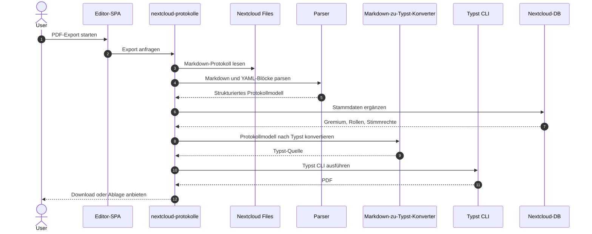
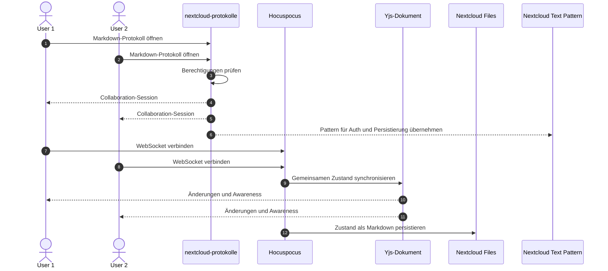

# Architektur

`nextcloud-protokolle` ist als eigenständige Nextcloud-App geplant, lehnt
sich aber bewusst eng an Nextcloud Text an. Nextcloud Text nutzt bereits
Markdown im Files-Tree, Tiptap, Yjs und Hocuspocus. Statt diesen Stack neu zu
erfinden, übernehmen wir passende Architektur-Patterns und ergänzen
domänenspezifische Protokollblöcke, Stammdaten und Typst-Export.

## Inhaltsverzeichnis

- [Komponenten-Übersicht](#komponenten-übersicht)
- [Datei-Format](#datei-format)
- [Datenmodell](#datenmodell)
- [Datenfluss A: User öffnet Protokoll](#datenfluss-a-user-öffnet-protokoll)
- [Datenfluss B: PDF wird exportiert](#datenfluss-b-pdf-wird-exportiert)
- [Datenfluss C: Zwei User editieren live parallel](#datenfluss-c-zwei-user-editieren-live-parallel)
- [Design-Entscheidungen](#design-entscheidungen)

## Komponenten-Übersicht

Die geplante Architektur besteht aus lose gekoppelten Schichten. Die App
bleibt eigenständig, orientiert sich aber an Nextcloud Text für Files-
Integration, Markdown-Persistierung, Tiptap-Setup und Collaboration-Muster.



1. **Nextcloud-App-Schicht**

   Diese Schicht integriert sich in Nextcloud Files, stellt Controller,
   Services, Datenbank-Migrationen und App-Routen bereit und prüft
   Berechtigungen über die bestehenden Nextcloud-Mechanismen. Sie ist die
   verbindende Schicht zwischen Dateiablage, Stammdaten, Export und UI.

2. **Editor-Schicht**

   Der Editor wird als Vue-3-Anwendung mit Tiptap geplant. Er arbeitet mit
   semantischen Blöcken statt nur mit formatiertem Fließtext. Custom Tiptap-
   Extensions erkennen eingebettete YAML-Code-Blöcke und rendern sie als
   interaktive Protokoll-UI.

3. **Collaboration-Schicht**

   Für Live-Collaboration sind Yjs und Hocuspocus vorgesehen. Die konkrete
   Auth-Bridge und Persistierung sollen sich am Muster von Nextcloud Text
   orientieren, damit wir nicht gegen die etablierte Nextcloud-Architektur
   arbeiten.

4. **Rendering- und Export-Schicht**

   PDF-Ausgaben werden final serverseitig mit Typst CLI erzeugt. Für schnelle
   Vorschauen im Browser ist später `typst.ts` geplant. Beide Wege sollen aus
   demselben aus Markdown und YAML-Blöcken geparsten Protokollmodell rendern.

5. **Authentifizierungs- und Personen-Schicht**

   Die App spricht nicht direkt mit authentik. Stattdessen koppelt
   `user_oidc` Nextcloud an authentik und erzeugt normale Nextcloud-User. Die
   App arbeitet primär mit diesen Nextcloud-Usern; externe Personen wie Gäste
   können zusätzlich manuell gepflegt werden.

## Datei-Format

Das primäre Speicherformat ist Markdown mit der Endung `.md`. Falls es für
App-Registrierung oder Dateizuordnung technisch hilfreich ist, kann später
eine speziellere Endung wie `.protokoll.md` genutzt werden.

Strukturierte Bestandteile wie Abstimmungen, Beschlüsse und Anwesenheitslisten
werden als YAML-Code-Blöcke eingebettet. Dadurch bleibt die Datei:

- in Nextcloud Text öffnungs- und bearbeitbar, dort als normaler Markdown-
  Text mit Code-Blöcken
- in unserem Editor öffnungs- und bearbeitbar, dort mit interaktiven
  Protokollblöcken
- in Wikis und anderen Markdown-Workflows lesbar
- menschenlesbar und diffbar

Beispiel:

````markdown
## TOP 3.a: Picknick im Herrngarten

Misha beantragt 150 Euro für Getränke...

```abstimmung
antrag: Picknick im Herrengarten
dafuer: 7
dagegen: 0
enthaltung: 0
ergebnis: angenommen
```
````

Custom Tiptap-Extensions parsen Code-Blöcke wie `abstimmung`, `beschluss`
oder `anwesenheit`, validieren die YAML-Daten und rendern daraus editierbare
UI-Blöcke. Beim Speichern wird wieder Markdown geschrieben.

## Datenmodell

Das Datenmodell trennt Stammdaten, Markdown-Dateien und abgeleitete Indizes.
Der Sitzungsinhalt lebt vollständig in der Markdown-Datei, nicht als JSON-Blob
in der Datenbank.

```mermaid
erDiagram
    GREMIUM ||--o{ ROLLE : definiert
    GREMIUM ||--o{ MITGLIEDSCHAFT : hat
    PERSON ||--o{ MITGLIEDSCHAFT : besitzt
    ROLLE ||--o{ MITGLIEDSCHAFT : wird_genutzt_in
    GREMIUM ||--o{ SITZUNGSINDEX : indiziert
    MARKDOWN_DATEI ||--|| SITZUNGSINDEX : wird_gecached_als
    MARKDOWN_DATEI ||--o{ SITZUNGSBLOCK : enthaelt
    SITZUNGSBLOCK ||--o| BESCHLUSS : kann_sein
    SITZUNGSBLOCK ||--o| ABSTIMMUNG : kann_sein
    ABSTIMMUNG ||--o| BESCHLUSS : kann_betreffen

    GREMIUM {
        string id
        string name
    }

    PERSON {
        string id
        string nextcloudUserId
        boolean extern
    }

    ROLLE {
        string id
        string name
        boolean stimmberechtigt
    }

    MITGLIEDSCHAFT {
        string id
        date von
        date bis
    }

    MARKDOWN_DATEI {
        string path
        string extension
    }

    SITZUNGSINDEX {
        string id
        string dateiPfad
        string gremiumId
        datetime datum
    }

    SITZUNGSBLOCK {
        string typ
        int reihenfolge
    }

    BESCHLUSS {
        string id
        string titel
        string status
    }

    ABSTIMMUNG {
        string id
        int dafuer
        int dagegen
        int enthaltung
    }
```



**Gremium** beschreibt eine organisatorische Einheit wie AStA, StuPa, FSK
oder einen Fachschaftsrat. Ein Gremium besitzt Namen, optionale Metadaten und
eine Menge von Rollen und Mitgliedschaften.

**Person** beschreibt eine natürliche Person. Primär arbeitet die App mit
Nextcloud-Usern, unabhängig davon, ob diese lokal, per LDAP oder über
`user_oidc` aus authentik provisioniert wurden. Externe Personen wie Gäste
oder beratende Teilnehmende bleiben manuell pflegbar.

**Rolle** beschreibt eine Funktion innerhalb eines Gremiums, zum Beispiel
Mitglied, Vorsitz, Gast, Protokoll oder beratendes Mitglied. Rollen tragen ein
Stimmrecht-Flag. Dadurch wird Stimmrecht nicht direkt an einzelne Personen
gehängt, sondern an die Rolle, die eine Person in einem Gremium innehat.

**Mitgliedschaft** verbindet Person, Rolle und Gremium über einen Zeitraum.
So lässt sich abbilden, dass eine Person in einem Semester stimmberechtigtes
Mitglied ist, später aber nur noch beratend teilnimmt oder aus dem Gremium
ausscheidet.

**Markdown-Datei** ist die primäre Quelle für Tagesordnung, Mitschrift,
Abstimmungen, Anwesenheit und Beschlüsse. Sie liegt im normalen Nextcloud-
Dateibaum und wird nicht als separater JSON-Blob in der DB gespeichert.

**Sitzungsindex** ist ein Cache in der Datenbank. Er speichert abgeleitete
Metadaten wie Gremium, Datum, Beschluss-IDs und Datei-Pfad. Der Index kann aus
den Markdown-Dateien neu aufgebaut werden.

**Sitzungsblock** ist ein strukturierter Abschnitt innerhalb einer Markdown-
Datei. Geplante Blocktypen sind TOP, Bullet, Abstimmung, Beschluss und
Anwesenheit. Strukturierte Blöcke werden über Markdown- und YAML-Strukturen
erkannt.

**Beschluss** ist eine abgeleitete Entität mit stabiler ID. Ein Beschluss
entsteht aus einem Beschluss- oder Abstimmungsblock und wird für Suche, Export
und spätere REST-APIs indexiert.

**Abstimmung** beschreibt eine strukturierte Entscheidungssituation mit
Dafür-/Dagegen-/Enthaltungswerten, Stimmrechtskontext und optionalem Bezug zu
einem Beschluss.

## Datenfluss A: User öffnet Protokoll



1. Ein*e Nutzer*in öffnet in Nextcloud Files eine Markdown-Datei.
2. Die Nextcloud-App prüft die Dateiberechtigung über Nextcloud.
3. Die App liest die Markdown-Datei aus dem Storage.
4. Markdown und eingebettete YAML-Code-Blöcke werden validiert.
5. Der Vue/Tiptap-Editor rendert Text und semantische Protokollblöcke.
6. Beim Speichern wird wieder Markdown geschrieben.

## Datenfluss B: PDF wird exportiert



1. Die Nutzerin oder der Nutzer startet den PDF-Export aus dem Editor.
2. Die Nextcloud-App liest die aktuelle Markdown-Datei.
3. Markdown und YAML-Code-Blöcke werden geparst.
4. Stammdaten wie Gremium, Rollen, Anwesenheit und Stimmrechte werden aus der
   Datenbank ergänzt.
5. Ein eigener Konverter erzeugt aus dem Protokollmodell Typst-Quelltext.
6. Typst CLI rendert das finale PDF.
7. Das erzeugte PDF wird als Download angeboten oder neben dem Protokoll in
   Nextcloud Files abgelegt.

Der finale Export läuft serverseitig, weil dort Fonts, Versionen und
Reproduzierbarkeit besser kontrollierbar sind als in einem Browser.

## Datenfluss C: Zwei User editieren live parallel



1. Zwei berechtigte Nutzer*innen öffnen dieselbe Markdown-Datei.
2. Die App prüft für beide die Berechtigung über Nextcloud.
3. Die Collaboration-Session folgt so weit wie möglich dem Muster von
   Nextcloud Text.
4. Yjs synchronisiert Änderungen in Echtzeit zwischen den Clients.
5. Awareness-Daten wie Cursor, Name und aktuelle Auswahl werden verteilt.
6. Der gemeinsame Zustand wird wieder als Markdown-Datei persistiert.

Die genaue Persistenzstrategie wird in Phase 2 festgelegt. Wichtig ist, dass
Nextcloud-Berechtigungen weiterhin die Autorität für Zugriff bleiben.

## Design-Entscheidungen

### Markdown als Speicherformat statt JSON

**Entscheidung:** Protokolle werden primär als Markdown-Dateien gespeichert.
Strukturierte Daten werden in YAML-Code-Blöcken eingebettet. Optional kann
eine Endung wie `.protokoll.md` genutzt werden, wenn das für die App-
Registrierung hilfreich ist.

**Begründung:** Markdown ist kompatibel mit Nextcloud Text, Wiki-tauglich,
menschenlesbar und gut versionierbar. Eingebettete YAML-Blöcke decken
strukturierte Daten wie Abstimmungen, Beschlüsse und Anwesenheitslisten ab.

**Konsequenzen:** Wir brauchen robuste Parser und Validatoren für
domänenspezifische YAML-Code-Blöcke. Dafür entfällt eine eigene
Files-Integration für ein separates JSON-Format, und Protokolle bleiben auch
außerhalb unserer App nutzbar.

### Architektonische Anlehnung an Nextcloud Text

**Entscheidung:** `nextcloud-protokolle` wird eine eigenständige App, lehnt
sich aber eng an Nextcloud Text an. Wir übernehmen keine Fork-Strategie,
sondern studieren und adaptieren Patterns.

**Begründung:** Nextcloud Text nutzt bereits unseren Kernstack: Tiptap, Yjs,
Hocuspocus, Markdown-Speicherung und Nextcloud-Files-Integration. Die App ist
Open Source unter AGPL-3.0 und bei der hda bereits erprobt.

**Konsequenzen:** Wir sparen eigene Architekturarbeit und reduzieren Risiko.
Dafür entsteht Aufwand für Code-Studium von Text und für saubere Abgrenzung:
keine Kopie als Fork, sondern eine eigenständige App mit parallel nutzbaren
Bibliotheken.

### Authentifizierung über user_oidc statt eigener authentik-Integration

**Entscheidung:** Die App integriert authentik nicht direkt. OIDC-Anbindung,
Login und Provisionierung laufen über `nextcloud/user_oidc`. Unsere App
arbeitet mit den Nextcloud-Usern, die dadurch entstehen.

**Begründung:** `user_oidc` ist die etablierte Nextcloud-OIDC-Brücke. Einen
eigenen authentik-Client in PHP zu pflegen, würde unnötige Sicherheits- und
Wartungsverantwortung erzeugen.

**Konsequenzen:** Voraussetzung für hda-nahe Installationen ist eine korrekt
konfigurierte `user_oidc`-Instanz. Studierendenschaften ohne authentik können
weiterhin normale Nextcloud-User oder andere Nextcloud-User-Backends nutzen,
weil die App nicht vom konkreten Auth-Backend abhängt.

### Datei-basiert statt DB-basiert

**Entscheidung:** Protokolle leben als Markdown-Dateien im normalen
Nextcloud-Dateibaum. Die Datenbank speichert Stammdaten, Rollen,
Mitgliedschaften und Indizes, aber nicht den primären Protokollinhalt.

**Begründung:** Protokolle sind Dokumente und sollen sich in Nextcloud wie
Dokumente verhalten: Sie liegen in Ordnern, können geteilt, verschoben,
versioniert, gesichert und über bestehende Berechtigungen kontrolliert werden.
Eine rein DB-basierte Ablage würde viele dieser Stärken umgehen und eine
zweite, app-spezifische Dokumentenwelt erzeugen.

**Konsequenzen:** Die App muss Markdown und YAML-Blöcke stabil validieren,
lesen und schreiben. Dafür bleibt der Files-Workflow für Nutzer*innen
verständlich und kompatibel mit Nextcloud-Sharing.

### Hybrid-Rendering

**Entscheidung:** Browser-Vorschau und finaler PDF-Export werden getrennt:
Live-Preview perspektivisch über `typst.ts`, verbindlicher Export
serverseitig über Typst CLI.

**Begründung:** Live-Arbeit braucht schnelle Rückmeldung. Dafür ist eine
Browser-Preview attraktiv, weil sie ohne Server-Roundtrip ein visuelles Gefühl
für das spätere PDF geben kann. Der finale Export braucht stabile Fonts,
reproduzierbare Versionen, saubere Fehlerbehandlung und serverseitige
Kontrolle.

**Konsequenzen:** Beide Renderer müssen aus demselben aus Markdown und YAML
abgeleiteten Protokollmodell gespeist werden. Der Server-Export bleibt die
maßgebliche Ausgabe, falls Vorschau und finaler Export voneinander abweichen.

### AGPL-3.0

**Entscheidung:** Das Projekt steht unter der GNU Affero General Public
License v3.0.

**Begründung:** Die App ist für gemeinschaftlich betriebene Infrastruktur
gedacht. Gerade bei serverseitiger Software kann es passieren, dass
Verbesserungen zwar genutzt, aber nicht zurückgegeben werden. Die AGPL-3.0
stellt sicher, dass auch bei Netzwerkbetrieb die Freiheit der Nutzer*innen und
die Rückgabe von Verbesserungen ernst genommen werden.

**Konsequenzen:** Betreiber*innen, die die App verändern und über das Netz
nutzbar machen, müssen die entsprechenden Quellen verfügbar machen. Das passt
zum Ziel, gemeinsame Lösungen für studentische Selbstverwaltung nicht in
isolierte Einzellösungen zerfallen zu lassen.

### Rollenbasierte Stimmrechte

**Entscheidung:** Stimmrechte werden über Rollen in Mitgliedschaften
abgeleitet, nicht direkt an einzelne Personen geschrieben.

**Begründung:** In Gremien hängt Stimmrecht selten dauerhaft an einer Person
allein. Es ergibt sich aus Funktion, Wahlperiode, Gremium und Zeitraum.

**Konsequenzen:** Wechsel werden nachvollziehbarer: Wenn eine Person eine
andere Rolle bekommt oder eine Mitgliedschaft endet, ändert sich das
Stimmrecht über die Struktur, nicht über einzelne Sonderregeln. Gleichzeitig
bleibt abbildbar, welche Personen in einer konkreten Sitzung stimmberechtigt
waren.

### Personen über Nextcloud-User plus manuelle Gäste

**Entscheidung:** Primäre Personenquelle sind Nextcloud-User. Die App muss
nicht wissen, ob diese lokal, per LDAP oder über `user_oidc` aus authentik
kommen. Externe Personen wie Gäste werden sekundär manuell gepflegt.

**Begründung:** Nextcloud ist bereits die Integrationsschicht für Identitäten.
Eine direkte Kopplung an authentik würde die App unnötig auf eine konkrete
hda-Infrastruktur festlegen.

**Konsequenzen:** Phase 1a muss klären, ob die hda-Nextcloud `user_oidc`
bereits nutzt und wie User-Attribute zuverlässig gelesen werden. Die App
bleibt zugleich für Installationen ohne authentik nutzbar.

### Versionsverwaltung über Nextcloud Files

**Entscheidung:** Das Projekt nutzt die eingebaute Dateiversionierung von
Nextcloud und implementiert keine eigene Versionierungsschicht für
Protokolldateien.

**Begründung:** Nextcloud bringt bereits eine bekannte Dateiversionierung mit.
Diese Entscheidung bedeutet weniger Code, weniger Wartung und weniger
Sonderlogik. Sie integriert sich außerdem in den Files-Workflow, den die
Nutzer*innen ohnehin kennen.

**Konsequenzen:** Wiederherstellung und Historie folgen den Nextcloud-
Mechanismen. Die App sollte keine konkurrierende Versionsoberfläche bauen,
sondern klar dokumentieren, wie Protokollversionen über Nextcloud Files
funktionieren.
