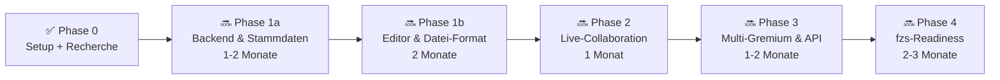

# Roadmap

Die Roadmap beschreibt den geplanten Weg von einem leeren Repository zu einer
nutzbaren Nextcloud-App. Zeitangaben sind grobe Schätzungen für ein junges
Open-Source-Projekt und hängen stark von Verfügbarkeit, Tests in echten
Gremiensitzungen und Rückmeldungen aus der Nextcloud-Umgebung ab.

| Phase | Titel | Status | Geschätzter Aufwand |
| --- | --- | --- | --- |
| Phase 0 | Projekt-Setup + Recherche | ✅ abgeschlossen | wenige Tage |
| Phase 1a | Backend & Stammdaten | 🔜 als Nächstes | 1-2 Monate |
| Phase 1b | Editor & Datei-Format | 🔜 geplant | 2 Monate |
| Phase 2 | Live-Collaboration | 🔜 geplant | 1 Monat |
| Phase 3 | Multi-Gremium & Beschluss-API | 🔜 geplant | 1-2 Monate |
| Phase 4 | fzs-Readiness | 🔜 geplant | 2-3 Monate |

## Querschnittsthemen

Diese Themen laufen über mehrere Phasen hinweg und sollen nicht erst am Ende
nachgezogen werden.

| Thema | Leitlinie |
| --- | --- |
| Tests | Ab Phase 1a automatisierte Tests für kritische Pfade: Stammdaten-CRUD, Markdown/YAML-Parser, Markdown-zu-Typst-Konverter und Stimmrechtsableitung. Die Testabdeckung wächst in jeder folgenden Phase mit. |
| Pilot-Sitzungen | Ab Phase 1b regelmäßig in echten Sitzungen der hda-Studierendenschaft testen. Feedback fließt direkt in die laufende Phase zurück. |
| User-Dokumentation | Ab Phase 1b parallel eine Bedienungsanleitung für Protokollführer*innen pflegen, nicht erst kurz vor Veröffentlichung. |
| Sicherheits-Review | Spätestens in Phase 2 für die Auth-Bridge, in Phase 4 erneut vor der App-Store-Submission. |
| Versionsverwaltung | Eingebaute Datei-Versionierung von Nextcloud nutzen; keine eigene Implementierung für Protokolldatei-Versionen. |
| Upstream-Tracking | Updates von Nextcloud Text, Tiptap, Hocuspocus, Yjs, user_oidc, Typst CLI und typst.ts verfolgen und relevante Änderungen in die App einarbeiten. |

---

## ✅ Phase 0 - Projekt-Setup + Recherche

**Status:** abgeschlossen

### Ziele

- Öffentliches Repository mit klarer Lizenz anlegen
- Grundlegende Dokumentation erstellen
- Architekturentscheidungen schriftlich festhalten
- Projektstruktur für spätere Komponenten vorbereiten
- Einen gemeinsamen sprachlichen Rahmen für Mitwirkende schaffen
- Upstream-Recherche dokumentieren und Architekturentscheidungen daraus
  ableiten

### Done when...

- [x] Das Repository ist initialisiert und enthält README, Roadmap,
  Architektur-Dokument, Beitragsplatzhalter, Lizenz und `.gitignore`.
- [x] Die geplanten Komponenten sind als leere Verzeichnisse sichtbar.
- [x] Die Lizenz ist eindeutig AGPL-3.0.
- [x] Es wird noch kein nicht lauffähiger App- oder Build-Code vorgetäuscht.
- [x] Die Recherche-Erkenntnisse sind in `docs/upstream-projects.md`
  dokumentiert.
- [x] Die Architektur ist auf Nextcloud Text, Markdown/YAML, user_oidc und
  Typst ausgerichtet.

### Geschätzter Aufwand

Wenige Tage für Setup, Abstimmung, Recherche und erste Dokumentation.

---

## 🧱 Phase 1a - Backend & Stammdaten

**Status:** als Nächstes

### Ziele

- Nextcloud-App-Skelett auf Basis des Nextcloud-App-Frameworks erstellen
- Code-Studium von Nextcloud Text durchführen, insbesondere Files-
  Integration, Markdown-Persistierung und Tiptap-Setup
- Klären, ob die hda-Nextcloud `user_oidc` nutzt und korrekt gegen authentik
  konfiguriert ist
- Stammdatenverwaltung für Gremien, Rollen und Mitgliedschaften umsetzen
- Personen primär aus Nextcloud-Usern referenzieren, unabhängig davon, ob sie
  lokal, per LDAP oder über `user_oidc` aus authentik kommen
- Settings-UI für Stammdaten bereitstellen
- Rollenbasierte Stimmrechtsableitung implementieren
- Setup-Dokumentation für Voraussetzungen beginnen:
  Nextcloud-Version, `user_oidc`, Typst CLI und benötigte App-Konfiguration
- Automatisierte Tests für Stammdaten-CRUD und Stimmrechtslogik beginnen

### Done when...

- [ ] Stammdaten können vollständig gepflegt und über die Settings-UI
  verwaltet werden.
- [ ] Gremien, Rollen und Mitgliedschaften sind in der Nextcloud-Datenbank
  abbildbar.
- [ ] Personen können aus Nextcloud-Usern referenziert werden.
- [ ] Geklärt ist, ob und wie die hda-Nextcloud `user_oidc` für authentik
  nutzt.
- [ ] Die relevanten Patterns aus Nextcloud Text für Files-Integration und
  Tiptap-Setup sind dokumentiert.
- [ ] Aus Rollen wird ableitbar, wer in einem Gremium stimmberechtigt ist.
- [ ] Kritische Stammdaten- und Stimmrechtslogik ist durch erste Tests
  abgesichert.

### Geschätzter Aufwand

1-2 Monate.

---

## 🧩 Phase 1b - Editor & Datei-Format

**Status:** geplant

### Ziele

- Custom Tiptap-Extensions für TOP, Bullet, Abstimmung, Beschluss und
  Anwesenheit entwickeln
- Files-Integration analog zu Nextcloud Text umsetzen und passende Patterns
  übernehmen
- Markdown-Persistierung mit eingebetteten YAML-Code-Blöcken einführen
- YAML-Blöcke für Abstimmungen, Beschlüsse und Anwesenheit parsen und
  validieren
- Markdown-zu-Typst-Konverter schreiben
- Serverseitigen PDF-Export über Typst CLI implementieren
- Bestehendes Typst-Template aus `dergabriel/asta-protokolle` als Layout-
  Basis weiterentwickeln
- Bedienungsanleitung für Protokollführer*innen parallel beginnen
- Pilot-Sitzungen mit realen Gremien vorbereiten und auswerten

Phase 1b nutzt ein einzelnes, generisches Template auf Basis des bestehenden
AStA-Protokoll-Layouts. Gremienspezifische Templates kommen bewusst erst in
Phase 3. Diese Phase soll zuerst beweisen, dass ein generischer Protokoll-
Workflow für eine reale Sitzung funktioniert.

### Done when...

- [ ] Eine reale Gremiensitzung kann mit der App protokolliert und als PDF
  exportiert werden.
- [ ] Ein*e Nutzer*in kann in Nextcloud ein Markdown-Protokoll anlegen,
  bearbeiten, speichern und wieder öffnen.
- [ ] Das Protokoll bleibt in Nextcloud Text als Markdown-Datei öffnungsbar.
- [ ] Abstimmungen und Beschlüsse werden als eingebettete YAML-Code-Blöcke
  strukturiert gespeichert.
- [ ] Der Markdown-zu-Typst-Konverter erzeugt eine saubere Typst-Quelle.
- [ ] Ein PDF kann serverseitig über Typst CLI reproduzierbar erzeugt werden.
- [ ] Der Single-User-MVP funktioniert ohne Live-Collaboration.

### Geschätzter Aufwand

2 Monate.

---

## 🤝 Phase 2 - Live-Collaboration

**Status:** geplant

### Ziele

- Hocuspocus-Server für Yjs-basierte Echtzeitbearbeitung bereitstellen
- Yjs in den Tiptap-Editor integrieren
- Auth-Bridge zur Nextcloud-Session nach dem Muster von Nextcloud Text
  entwerfen und umsetzen
- Awareness-Cursors und Präsenzinformationen anzeigen
- Markdown-Persistierung des kollaborativen Zustands nach dem Muster von
  Nextcloud Text umsetzen
- Browser-Live-Preview mit `typst.ts` erproben
- Sicherheits-Review der Auth-Bridge einplanen und durchführen

### Done when...

- [ ] Zwei angemeldete Nutzer*innen können dasselbe Protokoll gleichzeitig
  bearbeiten.
- [ ] Änderungen erscheinen ohne manuelles Neuladen bei allen Teilnehmenden.
- [ ] Der WebSocket-Zugriff respektiert Nextcloud-Berechtigungen.
- [ ] Die Auth-Bridge folgt dem Muster von Nextcloud Text.
- [ ] Anwesenheit und Cursorpositionen sind im Editor sichtbar.
- [ ] Die Live-Preview rendert eine realistische Vorschau über `typst.ts`,
  ohne den finalen Server-Export zu ersetzen.
- [ ] Die Auth-Bridge wurde mindestens einmal extern reviewed (Security).

### Geschätzter Aufwand

1 Monat.

---

## 🌐 Phase 3 - Multi-Gremium & Beschluss-API

**Status:** geplant

### Ziele

- Templates für unterschiedliche Gremienarten ergänzen, insbesondere
  StuPa, FSK und FSR
- Beschluss-Index als REST-API bereitstellen
- Beschlüsse über stabile IDs auffindbar machen
- Beschluss-Index aus den `abstimmung`-Blöcken aller Markdown-Protokolle
  aufbauen
- Markdown-Export für Wikis und externe Dokumentationssysteme ergänzen
- Manuelle Pflege externer Personen wie Gäste oder beratende Teilnehmende
  umsetzen
- Unterschiede zwischen Geschäftsordnungen und Protokollstilen abbildbar
  machen, ohne den Editor zu überladen
- Falls sich das Format ändert, Migrationen für Markdown-Protokolle aus
  Phase 1b bereitstellen

### Done when...

- [ ] Mehrere Gremien können eigene Vorlagen und Rollenmodelle verwenden.
- [ ] Beschlüsse lassen sich gremien- und sitzungsübergreifend abfragen.
- [ ] Der Beschluss-Index wird aus den `abstimmung`-Blöcken aller Markdown-
  Protokolle gebaut.
- [ ] Externe Personen können in Sitzungen, Anwesenheiten und Rollenmodellen
  sinnvoll manuell abgebildet werden.
- [ ] Externe Systeme können Beschlussdaten über eine dokumentierte API lesen.
- [ ] Ein Markdown-Export erzeugt brauchbare Inhalte für Wiki-Workflows.
- [ ] Die Datenstruktur bleibt kompatibel zu bestehenden Markdown-Protokollen
  aus Phase 1b oder es gibt eine dokumentierte Migration.

### Geschätzter Aufwand

1-2 Monate.

---

## 🚀 Phase 4 - fzs-Readiness

**Status:** geplant

### Ziele

- Internationalisierung für Deutsch und Englisch vorbereiten
- Setup-Dokumentation für andere Studierendenschaften schreiben
- Betrieb, Updates, Backup und Rechtekonzepte dokumentieren
- Nextcloud-App-Store-Submission vorbereiten
- Rückmeldungen aus externen Testinstallationen einarbeiten
- Sicherheits-Review vor der App-Store-Submission wiederholen

### Done when...

- [ ] Die App kann außerhalb der Hochschule Darmstadt nachvollziehbar
  installiert und konfiguriert werden.
- [ ] Die wichtigsten Oberflächentexte sind übersetzbar.
- [ ] Installations- und Betriebshinweise sind für ehrenamtliche Admins
  verständlich.
- [ ] Die App erfüllt die formalen Voraussetzungen für eine
  Nextcloud-App-Store-Einreichung.
- [ ] Das Projekt ist organisatorisch offen genug, damit weitere
  Studierendenschaften sinnvoll beitragen können.

### Geschätzter Aufwand

2-3 Monate.

---

## Wie diese Roadmap gepflegt wird

Diese Roadmap ist ein lebendes Projektdokument. Aufwände sind Schätzungen,
keine Zusagen, und sollen nach Pilot-Sitzungen, Reviews, Upstream-Änderungen
und Implementierungserfahrung angepasst werden. Änderungen an Scope,
Reihenfolge oder Done-when-Kriterien sollten nachvollziehbar begründet werden.
Pull Requests mit konkreten Verbesserungen sind willkommen.
